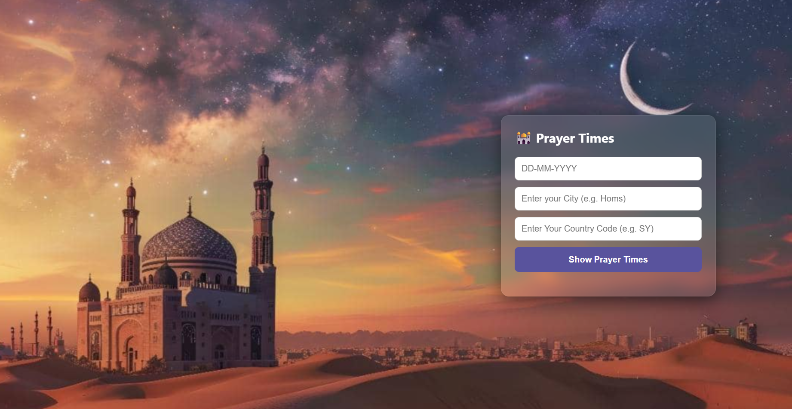
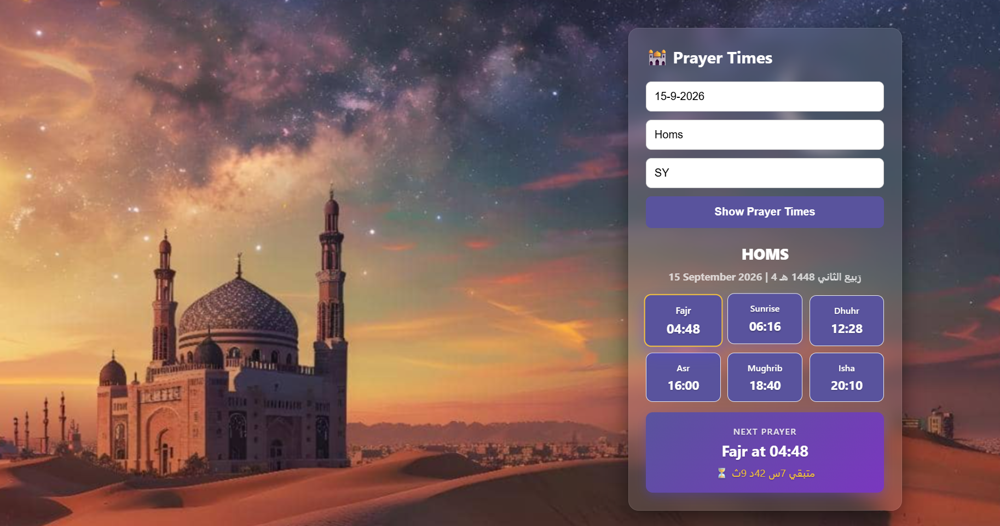

# 🕌 Prayer Times App

A simple and elegant web application that displays prayer times for any city in the world, built with **Vanilla JavaScript** and **Aladhan API**.

## ✨ Features

- 🔍 Search prayer times by city and country
- 🕌 Displays 6 prayer times: Fajr, Sunrise, Dhuhr, Asr, Maghrib, Isha
- ⏳ Live countdown to the next prayer (updates every second)
- 🌙 Displays both Gregorian and Hijri datesٍ
- ⭐ Highlights the next prayer with a unique design
- 🎨 Beautiful glassmorphism UI with a mosque background
- 🌍 Works for any city worldwide
- 📱 Fully responsive design

## 🛠️ Tech Stack

- **HTML5** — Structure
- **CSS3** — Styling (Glassmorphism, Flexbox, Grid)
- **JavaScript (Vanilla)** — Logic and DOM manipulation
- **Aladhan API** — Prayer times data
- **Fetch API** — Async data fetching
- **Async/Await** — Handling asynchronous operations

## 🚀 How to Run

1. Clone the repository:
   ```bash
   git clone https://github.com/ali-alfozo/prayer-times.git
   ```
2. Open `index.html` in your browser.

## 📸 Screenshots

### Before Search


### After Search


## 👨‍💻 Author
**Ali Alfozo**
 - GitHub: [@ali-alfozo](https://github.com/ali-alfozo)
